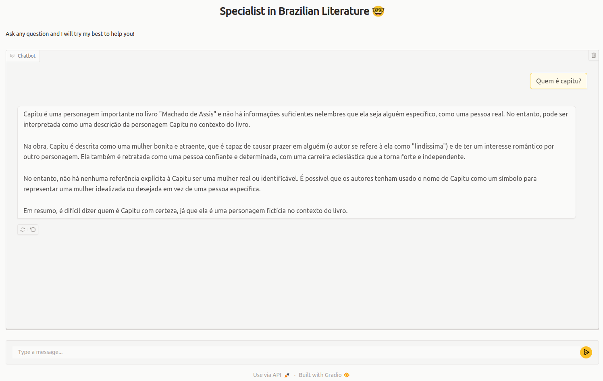
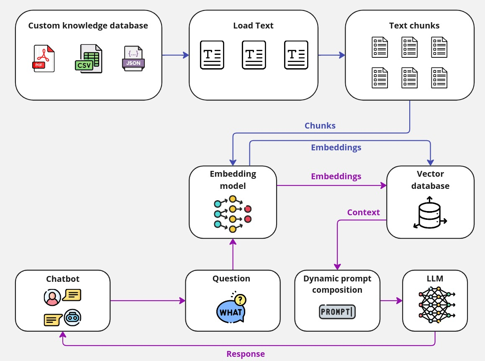

# Chatbot with RAG and LLM

This project is a Retrieval-Augmented Generation (RAG) based chatbot that answers questions using an LLM model and a vector database for document retrieval. The project is built with FastAPI, Gradio, and LangChain, providing a robust setup for interacting with a language model over a dataset created from PDFs.

Use case: As a simple use case, we created a chatbot that answers questions about Brazilian literature. To create our database, we used open-access Brazilian literature PDFs.

<div align="center">
  
</div>

## Features
- **LLM Model**: Uses the Ollama API to run an LLM (e.g., Llama 3.2 with 1B parameters).
- **API**: FastAPI-based API that handles requests to the LLM for efficient integration and scalability.
- **Chatbot Interface**: Created with Gradio for an interactive, user-friendly frontend.
- **Document Retrieval**: Implemented using LangChain to retrieve relevant chunks from the database based on user queries.
- **Embeddings and Vector Storage**: Text embeddings computed with `nomic-embed-text` and stored in a vector database (ChromaDB) for fast similarity-based retrieval.

## Project Structure
- `FastAPI`: Manages the backend API, handling incoming requests for language model predictions and document retrieval.
- `Gradio`: Provides a graphical interface to interact with the chatbot.
- `LangChain`: Used to build the RAG pipeline, including document chunking, embedding, and retrieval.
- `ChromaDB`: A vector database that stores document embeddings and retrieves the most relevant chunks based on cosine similarity.
  
## Setup Instructions

### Prerequisites
- Python 3.8 or higher
- [Ollama API](https://ollama.com/) account and configuration
- [Gradio](https://gradio.app/) library for the chatbot interface
- [FastAPI](https://fastapi.tiangolo.com/) for the API
- [LangChain](https://www.langchain.com/) for the RAG setup
- [ChromaDB](https://www.trychroma.com/) for vector storage

### Installation
1. Clone the repository:
   ```bash
   git clone https://github.com/GutoL/RAG-Project.git
   cd RAG-Project
   ```
2. Install dependencies:
  ```bash
    pip install -r requirements.txt
  ```
3. Set up the Ollama API to use the Llama model: Follow the Ollama documentation to configure server and check the files in the folder `ollama_server/` to start your server.
4. Add your PDFs to the `documents/` folder, and run the preprocessing script to chunk and embed the texts.

### Usage
- Chatbot Interface: Use the Gradio-based GUI to enter questions. The chatbot retrieves relevant text chunks from stored literature based on cosine similarity and responds with answers generated by the LLM.
- API Endpoints: You can interact directly with the FastAPI endpoints if building an application that integrates with this chatbot backend.


### How It Works

<div align="center">
  
</div>

1. RAG Pipeline:

- **Chunking**: PDFs are divided into chunks based on the text structure.
- **Embeddings**: Each chunk is embedded using the `nomic-embed-text` model.
- **Vector Storage**: Embeddings are stored in ChromaDB for efficient retrieval.
2. Query Processing:

- When a user submits a question, the system computes the query embedding.
- **Cosine Similarity**: Retrieves the top K most relevant chunks using cosine similarity.
- **LLM Response**: Passes the retrieved chunks to the LLM, which then generates a response.

### Technologies Used
- **LLM**: Llama 3.2 (1B parameters) via Ollama API
- **FastAPI**: Backend API management
- **Gradio**: Interface for chatbot interaction
- **LangChain**: Retrieval-Augmented Generation setup and document processing
- **ChromaDB**: Vector database for fast document retrieval

### License
This project is licensed under the Apache License 2.0 License. See the `LICENSE` file for more details.

### Acknowledgments
- [Ollama API](https://ollama.com/) for providing the LLM
- [LangChain](https://www.langchain.com/) and [ChromaDB](https://www.trychroma.com/) for RAG infrastructure
- [Gradio](https://gradio.app/) for the chatbot interface
